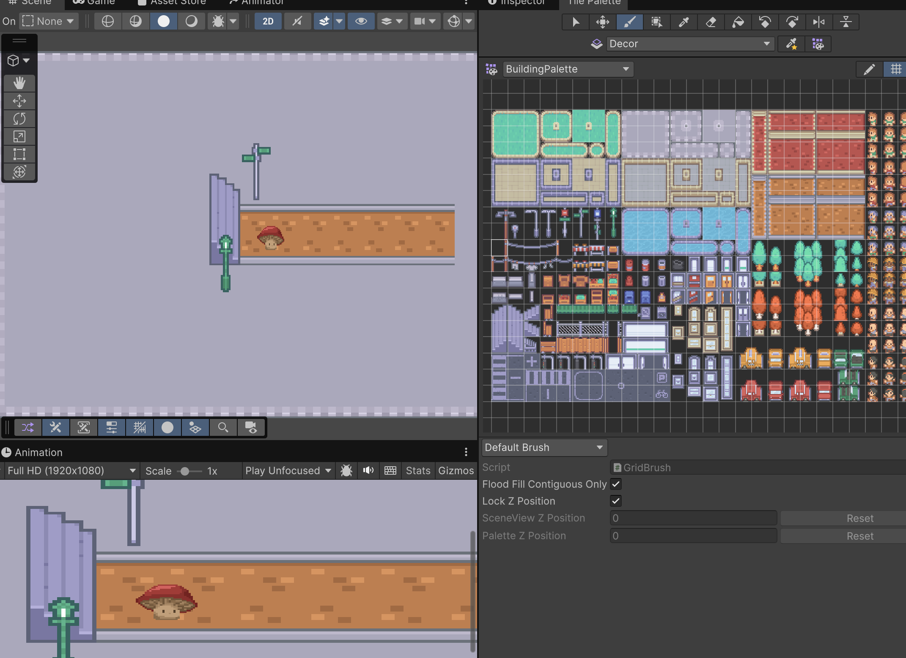
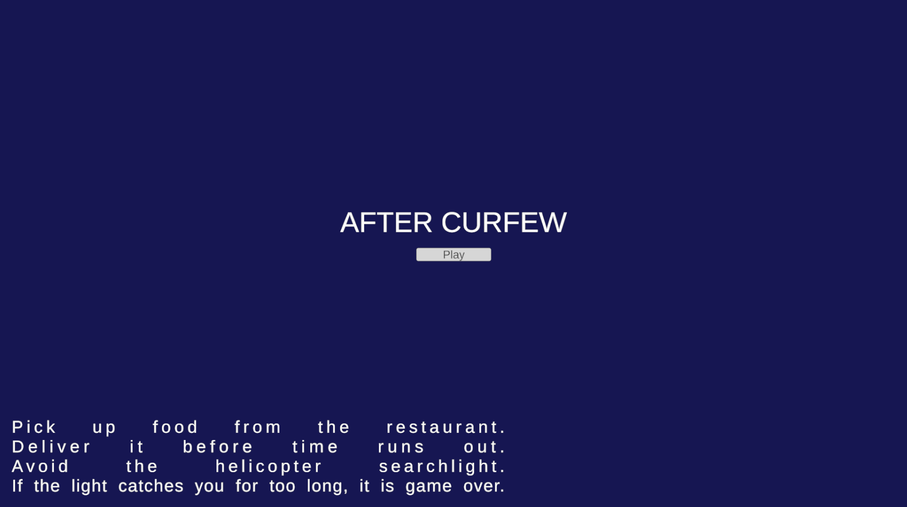
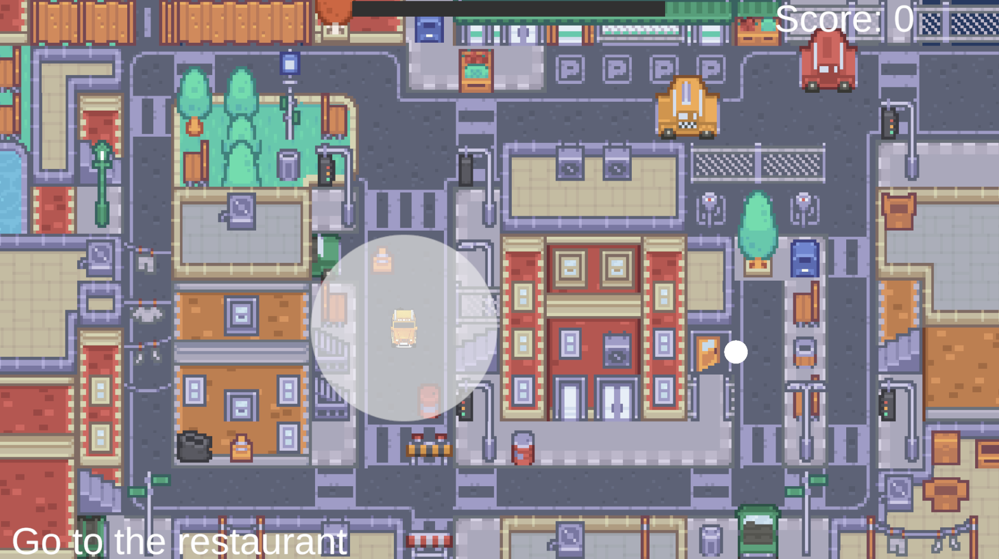
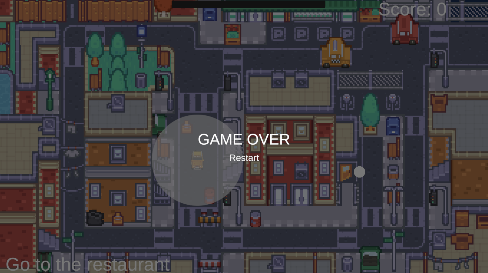

# Weekly Journal

## Week 1-2: Make a Thing!

### overview
My first assignment was to create something using a game engine. I missed the first day of class due to some family business outside of Canada. I got back during the second week, so I went through the slides and course outline to see what I needed to do for the second class.

### process
For this assignment, I decided to use the Bitsy tool to create a simple game. Since I was in Houston visiting my family, food was a big part of my day, especially since they are known for making some of the best BBQ. When I got back, it was still stuck in my mind. So for the game I created, I wanted to make something that revolves around Houston and food.

Bitsy is a very easy tool to work with, but sometimes I encountered bugs that I just couldn’t get around, which made me rethink and rebuild the gameplay—sort of building around the issues instead of eliminating them, since I couldn’t find a solution. One of the issues was that when adding more than two sprites, the game would bug out and give me a blue screen with white lines. I couldn’t do anything except restart from the beginning, and this happened so often that it took me much longer than expected.

Another problem I encountered was with the “item” sprite. I wanted to be able to pick up the item and bring it to a tile that would end the game, but I couldn’t figure out how to program it. I’m sure that if I had more time, I would have been able to find a solution.

All in all, it was an enjoyable experience creating the map, sprites, and animation. I went with a yellow and black color palette to simplify the visuals and help players distinguish the road from the buildings.

## Week 2-3

### overview

For this week, we started Unity and created are first project. I downloaded rider to facilitate my journey with Unity (or so I was told). I had a fee issues with guthub and connecting my github with Unity but figured it out quickly. There wasn't anything due next class but the teacher mentionned playing around with the Unity to familiarise ourselves with the engine.

### impression
My first time using Unity was easy going. I knew it was complex but it wasn't as confusing as i thought it would be. Creating sprites and coding them on rider was easy to understand. 

## Week 3-4

### Overview

This week we dove deeper into the mechanism and functions of the _Catch em all_ game. Learned how to add textboxes and a point system that would react to the game and update the scoreboard at the top of the screen. We also went over the triangle of prototyping which consists of role, look and feel, and implementation. _Catch Em ALl_ wasn't the only game we did, towards the end of the class we also went over a pong game. The teacher went through the game, explaining each line of codes but we didn't build it from scratch like the first game.

Although _Catch Em All_ was a simple game, it still holds a level of complexity that I haven't gotten used to yet. Same goes for the pong game. i think the main issue is the overlay and menus, that I am not comfrotable with yet. I'm not too worried since this is normal and goes for any other programs when you start learning.

### Prototype ideas

The teacher asked us to come up with an idea simple or complex to add or change in the Pong game that we just checked out. I immediately had an idea, _**Blind Pong**_ and the core idea is to make the paddles become invisible after 3-5 seconds of gameplay. I think this would be in the Feel/Role category. This change would play with the player's focus, tensions as well as predictions and timing since the a visual information is removed, the player would need to rely on their spatial memory. This change does not completely strip the game of its identity but explores more of the player psychology. How would a player react and perform if a major piece of visual information is removed during gameplay? That's the main question of this prototype. To put this prototype from paper to unity is something I haven't tried yet. But I do have some ideas such as adding a fade in and out for the paddles, and a sound cue whenever the ball hits the invisible paddle to give the player an audio feedback. This would confirm a hit as well as giving players a small dopamine reward. This keeps the game satisfying while making players track success through sound instead of sight.

## Week 4-5

### Overview

This week we went over the process of making the classic _Breakout_ game, learning the coding. The teacher explained how to add sound effects, to each of the variables and where to download them. The website instroduced by the teacher was actually very helpful. I can see myslef using that for future projects especially because its free for public use. We learned how to connect each scenes to each other through a seperate window (which is kinda clunky in my opinion). Created a death/game over scene for when the ball touches the bottom barrier. Went over the point system as well as a highscore screen which is shared with the game over screen.

### Prototyping

For this week's prototyping, we were given a task of coming up with some sort of features using what we learned in class. My idea was to create a powerup system that would drop whenever a brick has been hit. But I want to make it different from the traditional power up system. Most breakout games would give players power ups but they would either be good or bad depending on their colors for example. Me, I want to add gambling to the mix. By making the power ups mixed in with power downs, it makes the player second guess wether they would want to take the drops or not. The idea is to give the power ups the traditional effects such as multiple balls, slow balls, bigger paddle etc. But the power downs are the main focus. Giving them the ability to lessen the players senses (visual, hearing, etc.) This would disturb the players flow, and make them stay on their toes. The main idea was to make the paddle invisble so the player would have to rely on their paddle placement/mermory and to predict the paddle's speed. Taking away sound could be a good power down since it would disturb the flow of a player who has been hearing the hit sound and suddenly it goes quiet.

Creating a new script for powerUps, and in BrickScript.cs i added a powerUp prefab in drop (0.3) whenever a brick is hit. The powerUp would have a OnTriggerEnter2D when colliding with the paddle which calls the GameManager to apply the effect. But as time is running out, I find myself stuck and can't get the power up prefab to fall. Other minor issues are just syntac errors that caused a good chunk of my time.

So was it a success?
Not yet, I'm struggling to get this to work and am continuing to find the solution. But so far I feel good about this prototyping.

## Week 5-6

### Overview

This week in class we started working on a different scene in the Breakout file. Shmup. A scene composing of a rocking ship at sea with birds flapping their wings at the top of the screen. We learned how to animate the birds to make them look like theyre flapping their wings by rotating them back and forth using the animation timeline. It sounds simple and the action of their animtation looked simple but It was quite confusing the first time around. 

### Prototyping

This week's prototyping, I wanted to fix the issue of my last week's prototyping about the power up not showing up. I managed to fix it but i had to go to chatgpt to help me debug some issues. I managed to to make the triangles (power ups) to show up and fall down. Created the Triangles by making it a prefab, and adding a script to it called PowerUp.cs. It took alot of deubgs to understand which part is not going through during the game phase. Using instantiate in the BrickScript.cs to spawn children objects for different variables. Using _public void SetVisible(bool isVisible)_ in the breakoutPaddle to turn it invisible when the paddle hits the invisibilty power ups. I didn't want to make multiple color/shape for powerups because I don't want the player to be able to distinguish the difference of the power ups. I want a luck/gambling element in the game. One of the things that was funny to me was one of the power up or maybe power down in this case. This ability makes the paddle in scale, not horizontally but vertically. So by the end of my game, my paddle almost reached the top of the first half of the screen. And this makes it way harder to hit the ball since if u miss and the ball hits the side of your paddle, then it would just bounce infinitely until it reaches the bottom of the screen. Another ability is the ability for the ball to slow down, I don't know if I consider this a good ability in favor of the players since it could disrupt the flow of the game especially if it happens towards the end of the game. Players could be used to the pattern, timing of the ball and suddenly it slows down. My favorite ability is the invisibilty since it really challenges you to predict and understand where your paddle is without any visual cue. The first time it happened to me, even I was confused as to what had just happened, thinking my game has gone mad. But I figured out a trick to play with no paddle a few trys later. Overall, it was fun playing around with the abilities.

## Week 6-7

### Overview

Last class we started discussing about our final project. We discussed about the various techniques people do to get new ideas. So for last class, we were asked to make a list of keywords that pops up in our minds about our idea. Freestyling those keywords onto our notes we were then asked to find and pair up with a classmate to compare our keywords and find new connection. 3 rounds of this making it feel like speed dating. By picking at random one of our keywords each, hew ideas and mechanics could hopefully developped. Each round students have came up with funny yet interesting and unique ideas that are surprinsingly good. After three rounds of this, there were so many good ideas. 

### Ideation Process

My idea started when I randomly thought about my last week's chinese new year celebration. Each year for Chinese New Year, at the end of the night my family and I would play this Vietnamese dice betting game called _Bầu Cua Cá Cọp_. In that game, players bet on symbols and the three dices would determine the payout. The 6 symbols are layed out on a grid like pattern, and players would put money on the ones that feel like the dices would predict. The dices are normal 6 face dices with symbols on each face. Once rolled, the face facing up is the one we should look for. The three dices are placed in a salad bowl and a plate to close the top (that's our budget). Once shaken, the dealer would flip the think over and pulls up the salad bowl to reveal the three dices on the plate. This game made me realize that the structure of the game is simple yet full of tension, especially during the reveal moment. 

So i thought about gambling mechanics and how some games treat luck as something the player must overcome. Now what if I reverse the dynamic, what if the player is the dealer and not the one gambling? Instead of trying to beat the system, and win all the money, you become the house. The player is the house and their objective is to bankrupt the table. Kind of reinforcing the saying "_The house always wins_". I wanted to add a twist and the main mechanic of the game: Giving the player the ability influence the outcome of the game through game mechanics. Creating a good blend between randomness and control.

A few of the ideas that I got from my 5 minute conversations with my classmates are really good but quite complex. Although it is a simple gambling game, I'm aiming to integrate them into my game. 

Ideas:
- A cheating mechanic where the dealer can shake the bowl for an extra 1-2 seconds but at the risk of being caught. Only do it when the NPCs are not looking. 
- the ability to activitate your X-Ray ability to see the dices as you toss them but this ability don't last long.
- Reactive/adaptive NPCs. If the player manipulates the results too consistenly, NPCs become suspicious and become emotional (frustration, suspicion, joy, etc)

My three main vision for this game is the use of the dealer's POV with partial NPC visibilty. By positioning the camera in the dealer's perspective, it gives off a social vibe while still putting the main focus on the table. Giving the dealer the ability to see through the bowl gives a sense of control and don't make the player depend solely on chance to win the game. The suspiscion system is really interesting because it opens up so many opportunity. For example if the some symbols rarely appears, the npc would raise suspicion on you and bet less money or pulls out which is not what you want. This balances skill, timing and prevents obvious cheating.

The gameplay loop would be something like this
NPCs places bets on the 6 images -->> The player shakes the dices -->> The payout/reveal -->> suspicion check/reactions -->> End round

I was thinking that there would be a mandatory 5 second shake window, and another 2 second extra shake window right after. This would be indicated using a timer bar that goes down during the shaking phase to indicate when and how long the player has to shake. I think this its important to give the player a tracking system to keep the player hooked and wanting to play more. The tracking system is a score/money system that keeps track of everyones money. And the gols is to exhaust them until they have no money to their name.

## Week 8-9

### Overview

For the second stage of my prototyping process, I wanted to start testing out the different possible mechanics of the dice in my game. During the reading week, I though long and hard about how I will be able to bring this game to reality with just basic knowledge of Unity. I guess the questions that I needed answers to the most are implementations rather than visuals. I wanted to know whether I can create a working dice system in Unity that feels believable, free, and real while still holding a certain level of simplicity to it. For this week, I focused on searching on youtube for a good and solid tutorials to guid me through the process of building a working dice in Unity.

Reading week
- Found this video from youtube for the dice: https://www.youtube.com/watch?v=0-v4CbuJ5jI
- Easy, straight to the point.
- I just realized that almost all the videos/tutorial on youtube show a click mechanic for the dice. So there isn't any free movement to shake the dice. Since I haven't learned 3d yet I'm starting worry.
- Tutorial was a success but I'm now considering changing the overall mechanics of the games.

My initial idea was too big. NPC suspicion/detection, reations/emotions, the whole 3d scene with 3d charaters and money, advanced cheating mechanics, etc. These are all too complicated. I should build the main core mechanics first. 

After completing the dice tutorials, I realized that focusing on one mechanic at a time makes the project feel less overwhelming. Sometimes thinking about the whole project could be alot. If I could just single out each part at a time and take it one step at a time it would make the journey more easy and enjoyable. 

Took a break from unity and turned to Blender to create some assets. I saw tht you can easily bring Blender files into unity to used as assets so I was excited to create some models. I currently have a class on Blender so I wanted to put my knowledge to the test. I created a board with the Fish, Prawn, Crab images. I also made the three dices with the six different images on each faces. 

## Week 9-10

### Overview

Got really sick... 

After struggling with my Vietnamese dice game, I decided to change completely the scope of the game. Since I could barely sleep at night due to the pain, I took a lot of naps during the day. And suddenly I had this idea. Its a simple game but I realized how everytime I thought about a game, my first thought always goes back to the first time i discovered gaming. I was 6 years old when my dad came home and decided that I would get a gift that day. It was a DS zelda edition. So my first game was _Zelda: Phantom Hourglass_. The top down view was one of the most stand out feature for me. I was always used to playing 2d web browser games. And I think its because of zelda that I got this idea for a my game. A top down view game about a food deliver guy having to deliver to various locations throughout the city. But he picked up this job during the great Covid times. And he can only work late due to school. So he has to sneak out and deliver food without being caught by anyone, especially not by the authorities because of the curfew. I couldn't do much during the whole of this last week. So I will be doing much more this week.

## Week 11-12

### Overview

This week, I created a new 2D built-in render pipeline project to make my prototype. I took some CC0 character sprites and animations to test out the movement.

Monday: I added a red mushroom character to the scene. 

One of the things I learned in the tutorials is how to edit the sprite image and slice it up into 32x32 sections, since the sprite image contains multiple different frames of the character. By slicing it up, I now have multiple variations of the character, which I can then use to make an idle animation or a running animation. The process is fun, but more complex than I thought. I will not be implementing the animations yet. Right now, I just want to make my character move. So I created a Rigidbody2D and added a script for the character. I also added Player Input so that we can control the player using the WASD keys and the arrow keys. Everything so far went smoother than I thought. I always feel like Unity is so complicated, but making the movement was easy so far.

Tuesday: The next step for me is to create an idle animation and a running animation. 

Right now, I am still using a CC0 character sprite I found online, so all of this is just for testing. Once I feel like it is solid, I will then implement my custom-made sprites. For the animation, I added a folder in Assets called Animations and then dragged all the images and variations of the character into it, some for idle and some for walking. Once I opened the Animator window and added in the Blend Tree, I quickly realized how much more complex it was. I can create as many directional parameters as I want. So that means I can make a sprite with 8 directional variations for idling or walking. For now, I added all 8, but my sprite only has 2 since it is just a prototype. I am hoping that with the 8 directions already set up, I can come back and replace the current sprite with my custom sprite later. Once I connected all the animations and played around with the timeline, I connected the idle to the walk using transitions.

Wednesday: Today I downloaded a CC0 tileset that I want to test. 

I saw in a video that we can import tilesets and make each tile react differently to the player. So I imported two tilesets and then edited the sprites by slicing them up by cells, each 16x16, to turn the whole tileset PNG into small custom tiles. Once that was done, I created 2D Object > Tilemap > Rectangular for the map. There was a tutorial that showed me how to make different types of layers, for example one for the ground, one for walking in front, one for collision, one for walking behind, and one for decorations. Once I created the 5 different types of tile layers, I started custom-making the prototype map. I added the floor in the Ground tab, then switched to the WalkInFront tab to add the stairs, and then switched to the Collision tab to add light poles and fences. This was all new to me 2 hours ago, and now it feels really relaxing to do. There was one issue that I could not fix for a good hour, and it was when the player would collide with an object, the character would start to rotate. So I tested the prototype with that issue until I realized that I had to check the constraints for rotation for the player in Rigidbody2D.

Overall, the prototype feels like it is coming together, and it has some sort of vision coming to life.

### Week 12-13

## Overview

This week, I kept building the prototype for my top-down pixel art delivery game. The main thing I want to work on this week is try and create a working delivery system and starting to figure out how I want to implement the police spotlight. I wanted to make a npc police system but for the timeframe that I have, I quickly realized that it wouldn't be possible.

Friday: First, to create this system, I want to make it as simple to make as possible without lowering the quality of my prototype. So a sprite that pops up at a random but set location would be the delivery point. And everytime the player comes in contact with said sprite, the location changes and another one pops up. So I made a few possible drop-off points around the map and then used a script to randomly choose one of them. To make it easy for myself, I made the delivery location with a simple dot that appears on one of the points. The player has to move onto it and collide with it to complete the delivery. Once the player collides with it, the score increases and the dot moves to another random location. I was surprised that this part was easier than I thought. At first, I had some issues with the dot not appearing, but after fixing the sprite renderer, sorting layer, and checking that it was assigned properly in the script, it started working.

Sunday: Not a lot of time today but I want to add a score system so that every successful delivery updates the score. I also want to add a timer so that each delivery has to be completed within a certain amount of time. At first the timer was just a text (countdown 10,9,8,etc.), but I decided to change it to a bar instead because it feels more visual and easier to read during gameplay. Setting up the timer bar was a little confusing at first, especially because I had to understand how UI images and fill types work, but once I got the correct sprite and fill settings, it worked. I also had a small issue with the UI text disappearing when I changed the game window size. I learned that this was because of the anchors, so I fixed the UI by anchoring it properly and using the canvas scaler. 

Monday: Quick play around, I realized it still did not really feel like a food delivery game yet. Maybe its because I don't have a map yet but lets just say I do for now.

What if i make it more complex. 
The Delivery system.

A pick up point?
for each delivery? or just for the start
  - each deliver would be much more complex i think
  - but it would feel more complete and more tense
  - just for the start would be good also since its easier and still feels like a delivery game.

Wednesday:
Final decision...

So I added a restaurant pickup point. Now the player has to first go to the restaurant, pick up the food, and only then does the random delivery marker appear. Once the delivery is completed, the player has to go back to the restaurant again before doing the next one. This makes the gameplay feel much more complete and more like an actual delivery game instead of just chasing random points around the map. I also added an objective at the bottom of the map to show whether the player should go to the restaurant or deliver the food.

### Week 13-14

## Overview

Sunday: I started to work on the danger system for the game. At first, I thought about using a neighborhood watch npc that surveils the streets hoping to catch someone break curfew and calls the law, but I changed the idea into a helicopter searchlight instead. I think this choice fits the game much better because it feels more tense, easier to do than a full nightwatch npc with pathfinding or animations. I made the searchlight move randomly around the map instead of following fixed search points, because I wanted it to feel more unpredictable like a real helicopter searching from above. Made the spotlight move within a selected area, and when the player enters the light, it starts following them. If the player stays inside the light for around 5 seconds, then it becomes game over. I like this mechanic because it feels more fair than instantly losing, while still creating pressure and giving players a chance to escape. It also makes route planning much more important, because if the player ends up in a dead end or hesitates too long, they can get caught.

While working on the spotlight, I also had to think more carefully about the layout of my map. I added more delivery spots so that the routes would feel less repetitive and the player would have more possible destinations. around 9-10 is what I currently have right now. I also had issues with the tilemap because I had changed the scale and it caused many objects like the deliveries, UI, and objectives to feel out of place or outside the playable area. Its important to keep the scale of the tilemap and the rest of the game consistent. Don't change the size of the layers either. If you do then change each and one of them but if you only modify one than it will be offset with the others. Once I corrected, I was back in business. What I learned from this part of the process is that changing one thing in Unity, especially scale, will ruin your day.

After the spotlight was working, I wanted the game to have an actual losing state instead of only showing messages in the console. So I added a game over screen that appears either when the delivery timer runs out or when the player gets caught by the helicopter light. I made a panel with a game over text and a restart button. This part was a little confusing at first because I ran into some script naming issues. One of my scripts was already called GameManager and so I had to reorganize things and make a separate manager for the game over system. Even though that was a small issue, it really stressed me out espcially since I'm still new to Unity. 
  
  - The game over screen worked properly
  - Game feels much more complete

I also added a starting screen with a title, instructions, and a play button. Because right now the game looks good but it still feels more like a test/demo. Adding the start screen made the project feel more real. I also want to add a little context to the game, because I realized that there isn't anything that points towards coronavirus, curfew, 2020, lockdown etc.

Overall, the prototype now feels much closer to a real finished project. The spotlight mechanic added tension and danger and the game over and start screens makes it a somewhat real gaming experience. There is alot of things that I added without even planning or thought about before. Only when finishing the core game mechanics that I realized how important it is to have these little things that makes the game feel more alive. They may seem secondary at first, but they really change how finished the game feels. 

Wednesday: I replaced my texting sprite (player) for a real sprite. The Idea was to make a 16 by 16 bicycle delivery guy sprite but due to the limited time that I have I realized that it might me a little unrealistic to make it. I wanted the sprite to have all 8 directions/angles. meaning I would have to draw all 8 angles. Too long so I downloaded a free sprite on itch.io. So for now we will use that. I ran into probably the worst issue possible. I animated everything but for some reason my movements are not working. All the components were added on to the new sprite. everything was dragged into the right spot but for some reason, no movement. After countless youtube videos and reddit, I found out that the problem is because of my animations. I animated the sprites using the timestamps and accidently locked in the location into the animation. so whenever I move the player, the animation would always be locked on that location. the sprite would just look at the direction I'm pointing at but not mmove at all. It was a stupid issue but I'm glad I found it and will think twice when animating something.

### Final Week
## Playtest

Thursday: Today was playtesting day. It was really fun to go around the class and try people's game. Although the games were fun, listening to my classmates talk about their games was the most interesting part for me. There's just something so fun about listening to someone explain their ideation and thought process while making their game as you are playing THEIR game. What's the initial idea? How did it lead to this? What inspired them? Hearing about their struggles or ideas that didn't make it to the playtest in time makes their game feel more alive and real. I also learned alot from just looking at people play other peoples game. Ideas that I would have never thought of came to life that day. 

When people playtested my game, I was surprised as to how much they enjoyed the gameplay and artstyle. It seems like the artstyle really did its job and what I meant for it to do. People first mentions were feelings of nostalgia, old DS Zeldas, web games such as Miniclip, Nitrome, etc. These were exactly what inspired me to make this arcade game. As I was watching my classmates play. I noticed how easy it was for them to learn the controls and objectives. I thought about expanding the map into another scene once reaching a certain score, but a lot of feedbacks advised me not to and to keep it simple. One of the issues i see often is the collision between the players and the narrow road. Some delivery locations sometimes get stuck too much inside of the houses and the people wouldn't be able to reach it due to the collision. So I quiclky fixed that reducing the players collision area and bringing the delivery locations slightly outside to the streets. A got a lot of positive feedbacks regarding the 8 directional movement and animation of the players. Malcom seemed to have really enjoyed playtesting my game because he reached a highscore of 88 deliveries. He seemed pretty upset too when he got caught my the spotlight. 

## Polishing

Friday: I worked more on the restaurant pickup system. I wanted the pickup marker at the restaurant to disappear once the player picks up the food and then show up again after a succesful delivery. I thought this would make the gameplay loop more clear and polished. It feels more like the player is really doing a "pick up" now instead of just going back and forth randomly. I then went into Piskel.com to make some custom sprites for the pick up and the delivery points. For the pick up, I made a brown to-go bag and for the delivery, I made a small yellow circle like a typical gta objective marker. After that, I started adding sounds into the game. This part was more confusing than I thought because I had to understand the difference between an Audio Source and an Audio Clip. At first I kept mixing them up, but with the help of google assistant, reddit and Chatgpt I managed to get it to work. I also had more than one Audio Source and got confused about which one should be the sound effects one and which one should be for music. Once I started organizing it better, it made a lot more sense. I added sound effects for pickups, deliveries, and button clicks. I feel like even these small sounds already made the game feel way more alive and less empty.

Saturday: Today I worked on the background sound and the overall presentation of the game. I added background music and then made it quieter once the player clicks on the start button, because I didn't want it to be too loud during the actual gameplay. I also added another constant car engine sound in the background during gameplay without changing the actual music, which helped the game feel more alive. I realised how much sound can change the atmosphere because even though the visuals were already there, the game still felt kind of empty. I also added click sounds to both the start and again buttons, which makes the menus feel more responsive.

Overall, the last part of the project felt like a lot of polishing and fixing small things that actually made a big difference. Before, I was focused more on just getting the systems to work, but now I feel like I was focusing more on making the game feel complete. Which was the funnest part for me. I learned that the little details, like sounds, menus, and clear gameplay feedback, matter way more than I expected. They are not the main mechanic, but they really change how finished the game feels. I also learned again that Unity problems are often caused by something being disconnected, missing, or not assigned properly. I feel much more comfortable with debugging now than I did before. Looking at the game now, it feels really satisfying to see how much it changed from just a movement sprite in an empty protoype into something that feels like an actual finished mini arcade game.

References
- https://minzinn.itch.io/pixelvehicles?download (Player Sprite)
- https://sfxr.me/ (SFX)
- https://pixabay.com/music/video-games-8-bit-arcade-138828/ (music)
- https://kenney-assets.itch.io/rpg-urban-kit (tileset)
- https://www.piskelapp.com/p/create/sprite/ (custom made sprites)
- https://pixabay.com/sound-effects/film-special-effects-car-engine-noise-321224/ (car engine ambience)
  
